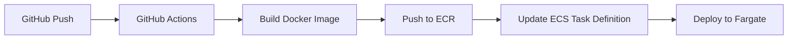

### **DevOps Engineer ইন্টারভিউ** প্রেক্ষাপটে, একজন DevOps হিসাবে **একটি traditional application-কে AWS-এ migrate করার জন্য কী কী ধাপ নেওয়া হয়** এবং প্রতিটি ধাপের **প্র্যাকটিক্যাল গাইডলাইন** দিচ্ছি, যাতে তুমি ইন্টারভিউতে শুধু থিওরি না বলে **real-world scenario** দিয়ে impress করতে পারো।

---

## 🎯 **DevOps Engineer Technical Interview Answer**

## ✅ প্রশ্ন:  
> "আপনারা একটি startup company-এর DevOps Engineer হিসাবে traditional application-কে AWS-এ migrate করবেন — আপনার কার্যপ্রণালী কী হবে?"

---

## 🧠 1. প্রথমে বুঝবো – “Current State Assessment”  
### 🔹 বাংলায়:
আমি প্রথমে কোম্পানির বর্তমান IT infrastructure সম্পূর্ণ বুঝবো। যেমন:

- Application কোথায় চলছে? (On-premise server / VPS?)
- কতগুলো environment আছে? (Dev, Staging, Prod?)
- Deployment কিভাবে হয়? (Manual SSH? CI/CD?)
- কোন OS, version, dependencies?
- ডাটাবেস কোথায়? কত ডেটা? Backup কেমন?
- কোন firewall, network rules, DNS?

### 🔹 English (Interview Style):
> “As a first step, I’d perform a thorough **current state assessment** to understand the existing architecture—servers, deployment process, dependencies, data volume, and networking. This helps me design a realistic migration strategy without surprises.”

### 🔧 Practical Guideline:
- Interviewer যদি জিজ্ঞাসা করে: *“How will you assess?”*
  - উত্তর:  
    ```bash
    # Example commands you can mention:
    lsb_release -a               # OS info
    systemctl list-units --type=service | grep running
    df -h                        # Disk usage
    netstat -tulnp               # Listening ports
    mysqldump --all-databases --dry-run  # Check DB size & structure
    ```
  - ডকুমেন্ট করবো: Architecture diagram, dependency list, IP/port mapping.

---

## 🧱 2. AWS Target Architecture Design  
### 🔹 বাংলায়:
আমি AWS-এ নিচের মতো একটি **cloud-native but practical architecture** ডিজাইন করবো:

| Component       | AWS Service Suggestion |
|------------------|------------------------|
| Frontend (React) | S3 + CloudFront        |
| Backend (Node.js)| ECS Fargate / EKS      |
| Database         | RDS (PostgreSQL or MariaDB) |
| Cache            | ElastiCache (Redis)    |
| Reverse Proxy    | ALB + Nginx in container OR skip if ALB handles routing |
| CI/CD            | CodePipeline + CodeBuild |
| Monitoring       | CloudWatch + X-Ray     |
| Secrets          | AWS Secrets Manager    |

> ⚠️ Note: Startup হলে cost-efficient solution দেওয়া জরুরি। So avoid over-engineering.

### 🔹 English:
> “I’d propose a **cost-effective, scalable, and secure** target architecture using managed services like RDS for databases, ECS Fargate for containers (no EC2 management), S3+CloudFront for static frontend, and ElastiCache for Redis. This reduces operational overhead.”

### 🔧 Practical Guideline:
- Interviewer জিজ্ঞাসা করতে পারে: *“Why not EC2 for Node.js?”*
  - উত্তর:  
    > “Fargate is serverless—no patching, scaling, or AMI management. For a startup with limited DevOps bandwidth, it’s ideal. Later, if needed, we can move to EKS.”

- কীভাবে deploy করবো?
  - React → `aws s3 sync build/ s3://my-react-bucket`
  - CloudFront origin = S3 bucket
  - Node.js → Docker image → Push to ECR → Run on ECS Fargate
  - RDS → Multi-AZ, automated backup enabled
  - ElastiCache → Same VPC as backend, security group restricted

---

## 🔄 3. Migration Strategy (Lift & Shift vs Refactor)  
### 🔹 বাংলায়:
আমি **phased migration** করবো:

1. **Phase 1**: Frontend (React) → S3 + CloudFront (zero downtime)
2. **Phase 2**: Redis → ElastiCache (test with copy of data)
3. **Phase 3**: Database → RDS (use AWS DMS or logical dump)
4. **Phase 4**: Backend → Containerize → Deploy to ECS

> সবকিছু একসাথে migrate করবো না — risk কমানোর জন্য ধাপে ধাপে।

### 🔹 English:
> “I follow a **phased migration approach** to minimize risk. Start with stateless components (frontend), then cache, then database (with cutover window), and finally backend. Each phase is tested in staging before production.”

### 🔧 Practical Guideline:
- **Database Migration**:
  - Use `pg_dump` or `mysqldump` → restore to RDS
  - Or use **AWS DMS (Database Migration Service)** for minimal downtime
  - Test connectivity from ECS task to RDS using VPC peering/security groups

- **Zero-downtime frontend**:
  - Keep old DNS pointing to old server
  - Deploy new React on S3+CloudFront
  - Test via `/etc/hosts` override
  - Then switch DNS TTL low → update to CloudFront domain

---

## 🛡️ 4. Security & Compliance  
### 🔹 বাংলায়:
- IAM roles দেবো (not access keys!)
- Secrets (DB password, API keys) → AWS Secrets Manager
- VPC with public/private subnets
- Security Groups: only allow necessary ports (e.g., 443 from internet, 5432 only from backend)
- Enable encryption (at rest + in transit)

### 🔹 English:
> “Security is built-in: IAM roles for services, secrets in Secrets Manager, encrypted RDS/ElastiCache, and least-privilege security groups. No hardcoded credentials in code or env files.”

### 🔧 Practical Guideline:
- ECS task role example:
  ```json
  {
    "Version": "2012-10-17",
    "Statement": [
      {
        "Effect": "Allow",
        "Action": ["secretsmanager:GetSecretValue"],
        "Resource": "arn:aws:secretsmanager:us-east-1:123456789:secret:prod/db-*"
      }
    ]
  }
  ```
- In Node.js app:
  ```js
  const { SecretsManager } = require('aws-sdk');
  const secret = await new SecretsManager().getSecretValue({ SecretId: 'prod/db-creds' }).promise();
  ```

---

## 🚀 5. CI/CD Pipeline Setup  
### 🔹 বাংলায়:
- GitHub/GitLab → CodePipeline trigger
- CodeBuild: build Docker image → push to ECR
- CodeDeploy / ECS rolling update

### 🔹 English:
> “I’ll set up a fully automated CI/CD pipeline using AWS CodePipeline. On git push, it builds the Docker image, runs tests, pushes to ECR, and deploys to ECS with zero downtime using blue/green or rolling updates.”

### 🔧 Practical Guideline:
- `buildspec.yml` example:
  ```yaml
  version: 0.2
  phases:
    pre_build:
      commands:
        - echo Logging in to Amazon ECR...
        - aws ecr get-login-password | docker login --username AWS --password-stdin $AWS_ACCOUNT.dkr.ecr.$AWS_REGION.amazonaws.com
    build:
      commands:
        - docker build -t my-node-app .
        - docker tag my-node-app:latest $AWS_ACCOUNT.dkr.ecr.$AWS_REGION.amazonaws.com/my-node-app:latest
    post_build:
      commands:
        - docker push $AWS_ACCOUNT.dkr.ecr.$AWS_REGION.amazonaws.com/my-node-app:latest
        - echo "Image pushed. Updating ECS service..."
        - aws ecs update-service --cluster my-cluster --service my-service --force-new-deployment
  ```

---

## 📊 6. Monitoring & Logging  
### 🔹 বাংলায়:
- CloudWatch Logs: container logs
- CloudWatch Alarms: CPU, memory, error rates
- Custom metrics: API latency, DB connections
- Optional: OpenSearch for log analysis

### 🔹 English:
> “Observability is critical. I enable CloudWatch logging for all containers, set alarms for anomalies, and use X-Ray for distributed tracing if needed.”

---

## 💡 Bonus: Cost Optimization Tips (Startup-friendly)
- Use **Spot Instances** for non-prod environments
- **S3 Intelligent-Tiering** for frontend assets
- **RDS Auto Pause** (if using Aurora Serverless v2)
- **Delete unused ECR images** with lifecycle policy

---

## 🎯 Final Answer Summary (For Interview):

> “As a DevOps Engineer, my approach to migrating your traditional stack to AWS would be:  
> **1. Assess current state**,  
> **2. Design a simple, secure, and cost-effective target architecture using managed services**,  
> **3. Execute phased migration starting with stateless components**,  
> **4. Automate everything with CI/CD**,  
> **5. Enforce security via IAM, Secrets Manager, and network controls**,  
> **6. Ensure observability with CloudWatch.**  
>   
> This minimizes risk, reduces operational burden, and aligns with startup agility.”

---

## 📌 Extra: Common Follow-up Questions & Answers

### Q1: “What if the database is huge (1TB+) and can’t afford downtime?”
> **A**: Use **AWS DMS (Database Migration Service)** with ongoing replication. Set up source → target sync, let it catch up, then cut over during maintenance window. Test thoroughly in staging.

### Q2: “How do you handle config differences between dev/staging/prod?”
> **A**: Use **parameter store** or **secrets manager** with naming convention like `/app/prod/db_host`. Inject via environment variables in ECS task definition.

### Q3: “Why not use Kubernetes (EKS)?”
> **A**: For a small team/startup, **ECS Fargate** is simpler—no control plane management, faster setup, and lower cognitive load. We can adopt EKS later when complexity grows.

---

## 🔹 **প্রশ্ন ১: "আপনি AWS-এর কী কী জানেন এবং কী কী কাজ করেছেন?"**

### 🇧🇩 **বাংলায় (Realistic & Honest):**
> "আমি AWS-এর core services গুলো ব্যবহার করেছি—যেমন:  
> - **EC2, VPC, Security Groups** → Infrastructure setup  
> - **S3, CloudFront** → Static hosting (React app)  
> - **RDS (PostgreSQL), ElastiCache (Redis)** → Managed DB & cache  
> - **ECS/Fargate** → Container orchestration (no Kubernetes yet)  
> - **IAM, Secrets Manager** → Secure access & secrets  
> - **CloudWatch, X-Ray** → Monitoring & tracing  
> - **Route 53, ALB** → DNS & load balancing  
>  
> আমি **Terraform দিয়ে IaC** লিখেছি, **CI/CD pipeline** (GitHub Actions → ECR → ECS) সেটআপ করেছি, এবং **cost optimization** (right-sizing, reserved instances) করেছি।  
>  
> আমার home lab-এ আমি OpenShift CRC + AWS CLI ব্যবহার করে hybrid test করি।"

### 🇬🇧 **In Simple English:**
> "I’ve hands-on experience with:  
> - **Compute**: EC2, ECS/Fargate  
> - **Networking**: VPC, ALB, Route 53  
> - **Storage**: S3, EBS  
> - **Database**: RDS (PostgreSQL), ElastiCache (Redis)  
> - **Security**: IAM roles, Secrets Manager, Security Groups  
> - **Observability**: CloudWatch Logs/Metrics, X-Ray  
> - **Automation**: Terraform (IaC), GitHub Actions (CI/CD)  
>  
> I’ve deployed full-stack apps (React + Node.js + DB) on AWS, secured them, and set up monitoring. I also optimize costs by right-sizing instances and using reserved capacity where possible."

### 🛠️ **প্র্যাকটিক্যাল গাইডলাইন (যদি জিজ্ঞাসা করে: “Show me how you deployed an app”):**
```bash
# 1. Create VPC (Terraform)
terraform {
  required_providers {
    aws = { source = "hashicorp/aws" }
  }
}
provider "aws" { region = "us-east-1" }

resource "aws_vpc" "main" {
  cidr_block = "10.0.0.0/16"
}

# 2. Push Docker image to ECR
aws ecr create-repository --repository-name my-node-app
docker build -t my-node-app .
docker tag my-node-app:latest 123456789.dkr.ecr.us-east-1.amazonaws.com/my-node-app:latest
docker push ...

# 3. Deploy to ECS Fargate (via task definition + service)
# Use AWS Console or Terraform aws_ecs_service
```

> 💡 **Follow-up ready**: If asked “How did you handle DB migration?”, say:  
> “I used **AWS DMS (Database Migration Service)** for zero-downtime cutover, or `pg_dump` + `pg_restore` during maintenance window.”

---

## 🔹 **প্রশ্ন ২: "DDoS Attack হলে কীভাবে monitor ও prevent করবেন?"**

### 🇧🇩 **বাংলায়:**
> "DDoS মূলত ২ ধরনের:  
> 1. **Network-layer (L3/L4)** → যেমন SYN flood  
> 2. **Application-layer (L7)** → যেমন HTTP flood  
>  
> **Prevention**:  
> - **AWS Shield Standard** → সব AWS customer-এর জন্য free, L3/L4 attack block করে  
> - **AWS Shield Advanced** → $15/month, L7 protection + DDoS response team  
> - **Web Application Firewall (WAF)** → Rate-based rules (e.g., block IP if >100 req/min)  
> - **ALB + Auto Scaling** → Traffic absorb করতে পারে  
>  
> **Monitoring**:  
> - CloudWatch metrics: `RequestCount`, `HTTPCode_ELB_5XX`  
> - AWS WAF logs → S3 + Athena for analysis  
> - Enable **VPC Flow Logs** to detect unusual traffic patterns"

### 🇬🇧 **In Simple English:**
> "For DDoS:  
> - **Prevent**: Use **AWS Shield Standard** (free, blocks network floods) + **WAF** (for HTTP floods). Set rate-limiting rules like “block IP if >100 requests/5 mins”.  
> - **Absorb**: Put app behind **Application Load Balancer (ALB)** + enable **Auto Scaling** so it can handle traffic spikes.  
> - **Monitor**: Watch CloudWatch metrics like `HTTPCode_ELB_5XX` and `HealthyHostCount`. Enable **WAF logs** to S3 and analyze with Athena.  
>  
> For critical apps, I recommend **Shield Advanced**—it includes 24/7 DDoS response team."

### 🛠️ **প্র্যাকটিক্যাল গাইডলাইন (WAF Rate Limit Setup):**
1. Go to **AWS WAF → Web ACLs → Create Web ACL**
2. Add rule: **Rate-based rule**
   - Count: 100 requests
   - Interval: 5 minutes
   - Action: Block
3. Associate with **ALB or CloudFront**
4. Enable **logging** to S3

> 💡 **Follow-up ready**: If asked “What if attack bypasses WAF?”, say:  
> “I’d use **CloudFront in front of ALB** (adds another layer), and enable **AWS Shield Advanced** for automatic mitigation.”

---

## 🔹 **প্রশ্ন ৩: "Private DB-কে Public Network থেকে কীভাবে Access করবেন?"**

### 🇧🇩 **বাংলায়:**
> "Production DB **কখনোই public subnet-এ রাখব না**।  
> Developer-দের access দেওয়ার জন্য আমি ৩টি secure approach ব্যবহার করি:  
> 1. **Bastion Host (Jump Server)** → EC2 in public subnet, SSH tunnel দিয়ে private DB-তে connect  
> 2. **AWS Session Manager** → No open SSH port! IAM role দিয়ে browser/CLI থেকে direct access  
> 3. **AWS Client VPN** → Developer-দের laptop থেকে VPC-এর ভিতরে connect  
>  
> আমি **Session Manager** সবচেয়ে বেশি পছন্দ করি—কারণ এটা **port 22 open করে না**, audit log রাখে, এবং MFA support করে।"

### 🇬🇧 **In Simple English:**
> "Never put DB in public subnet. To give devs access:  
> 1. **Bastion Host**: EC2 in public subnet → SSH tunnel to RDS  
> 2. **Session Manager (Preferred)**: Use AWS Systems Manager → no open ports, IAM-controlled, full audit trail  
> 3. **Client VPN**: For frequent access, set up OpenVPN via AWS Client VPN  
>  
> I prefer **Session Manager** because it’s more secure (no SSH exposure) and integrates with IAM."

### 🛠️ **প্র্যাকটিক্যাল গাইডলাইন (Session Manager Setup):**
1. Install **SSM Agent** on a **private EC2 instance** (or use RDS Proxy if only DB access needed)
2. Attach IAM policy `AmazonSSMManagedInstanceCore` to the instance role
3. From local machine:
   ```bash
   aws ssm start-session --target i-1234567890abcdef0
   ```
4. Then from that session, connect to RDS:
   ```bash
   psql -h mydb.xxxxx.us-east-1.rds.amazonaws.com -U admin
   ```

> 💡 **Follow-up ready**: If asked “Can I connect directly to RDS without EC2?”, say:  
> “Not securely. But you can use **RDS Proxy** + **IAM auth** + **Session Manager port forwarding** for direct-like access.”

---

## 🔹 **প্রশ্ন ৪: "Multiple developers কীভাবে একই Terraform state-এ কাজ করবে?"**

### 🇧🇩 **বাংলায়:**
> "Terraform-এ **local state file (.tfstate)** শেয়ার করা কখনোই ঠিক না।  
> আমি **remote backend** ব্যবহার করি—যেমন: **S3 + DynamoDB**  
> - **S3**: `.tfstate` file store করে  
> - **DynamoDB**: State locking (prevent race condition)  
>  
> Workflow:  
> 1. All devs use same `backend.tf`  
> 2. Before `terraform apply`, Terraform auto-locks state via DynamoDB  
> 3. After apply, state updates in S3  
>  
> আর CI/CD-এ আমি **separate state per environment** (dev/staging/prod) রাখি, যাতে একটা mistake production-এ effect না ফেলে।"

### 🇬🇧 **In Simple English:**
> "We **never commit .tfstate to Git**. Instead, we use **remote state**:  
> - **Backend**: S3 bucket (encrypted)  
> - **State Locking**: DynamoDB table (to prevent concurrent runs)  
>  
> Every developer runs:
> ```hcl
> terraform {
>   backend "s3" {
>     bucket = "mycompany-terraform-state"
>     key    = "prod/vpc/terraform.tfstate"
>     region = "us-east-1"
>     dynamodb_table = "terraform-locks"
>   }
> }
> ```
> Before `apply`, Terraform locks the state. Only one person can apply at a time."

### 🛠️ **প্র্যাকটিক্যাল গাইডলাইন (Setup S3 + DynamoDB Backend):**
```bash
# 1. Create S3 bucket (enable versioning & encryption)
aws s3api create-bucket --bucket my-terraform-state-12345 --region us-east-1
aws s3api put-bucket-versioning --bucket my-terraform-state-12345 --versioning-configuration Status=Enabled

# 2. Create DynamoDB table
aws dynamodb create-table \
  --table-name terraform-locks \
  --attribute-definitions AttributeName=LockID,AttributeType=S \
  --key-schema AttributeName=LockID,KeyType=HASH \
  --billing-mode PAY_PER_REQUEST

# 3. In Terraform code, add backend config (as above)
```

> 💡 **Follow-up ready**: If asked “What if someone deletes state?”, say:  
> “S3 versioning lets us restore. Also, I run `terraform state pull > backup.tfstate` weekly.”

---

## 🔹 **প্রশ্ন ৫: "AWS Load Balancer নিয়ে কাজ করেছেন? কী কী করেছেন?"**

### 🇧🇩 **বাংলায়:**
> "হ্যাঁ, আমি **Application Load Balancer (ALB)** ব্যবহার করেছি:  
> - **Path-based routing**: `/api` → Node.js, `/` → React (S3)  
> - **Health checks**: `/health` endpoint check করে unhealthy instance remove করে  
> - **SSL/TLS**: ACM certificate attach করে HTTPS enable করেছি  
> - **Logging**: Access logs S3-এ send করেছি (security audit)  
> - **WAF integration**: DDoS/rate limiting  
>  
> আমি **Network Load Balancer (NLB)** ও ব্যবহার করেছি—যখন low-latency TCP traffic (e.g., gaming server) ছিল।"

### 🇬🇧 **In Simple English:**
> "Yes, I’ve used **ALB extensively**:  
> - Route `/api/*` to ECS (Node.js), `/static/*` to S3  
> - Set health check path to `/health`  
> - Attached **ACM SSL certificate** for HTTPS  
> - Enabled **access logs to S3** for security analysis  
> - Integrated with **WAF** for rate limiting  
>  
> I also used **NLB** for high-performance TCP apps (like real-time services)."

### 🛠️ **প্র্যাকটিক্যাল গাইডলাইন (ALB with Path Routing in Terraform):**
```hcl
resource "aws_lb" "main" {
  name               = "my-alb"
  internal           = false
  load_balancer_type = "application"
  security_groups    = [aws_security_group.alb.id]
  subnets            = module.vpc.public_subnets
}

resource "aws_lb_listener" "https" {
  load_balancer_arn = aws_lb.main.arn
  port              = "443"
  protocol          = "HTTPS"
  certificate_arn   = aws_acm_certificate.cert.arn

  default_action {
    type             = "fixed-response"
    fixed_response {
      content_type = "text/plain"
      message_body = "404"
      status_code  = "404"
    }
  }
}

# Rule for /api
resource "aws_lb_listener_rule" "api" {
  listener_arn = aws_lb_listener.https.arn
  priority     = 100

  action {
    type             = "forward"
    target_group_arn = aws_lb_target_group.api.arn
  }

  condition {
    path_pattern {
      values = ["/api/*"]
    }
  }
}
```

> 💡 **Follow-up ready**: If asked “How do you handle WebSocket?”, say:  
> “ALB supports WebSocket by default—just ensure idle timeout ≥ WebSocket keep-alive (e.g., 600 sec).”

---

## ✅ Final Tip for Interview:
> Always connect your answer to **business impact**:  
> - “I reduced cost by 30% using reserved instances”  
> - “I prevented downtime during Black Friday traffic spike”  
> - “I cut deployment time from 30 min to 3 min”

---


---
### 🇧🇩 **বাংলায় (সহজ ও বাস্তব প্রেক্ষাপটে):**

> "আমি যদি একজন DevOps Engineer হিসেবে একটি startup-এর traditional application-কে AWS-এ migrate করতে আসি, তাহলে আমি প্রথমে বর্তমান system-টির **full assessment** করব।  
> 
> অর্থাৎ—  
> - কোন OS ব্যবহার হচ্ছে?  
> - কোথায় কোন service (nginx, Node.js, Redis, DB) চলছে?  
> - কোন dependency বা custom script আছে?  
> - কতগুলো user, traffic pattern, backup policy আছে?  
> 
> এরপর আমি **AWS architecture design** করব—  
> - Frontend (React) → S3 + CloudFront (static hosting)  
> - Backend (Node.js) → ECS/EKS/EC2 (containerized or VM-based)  
> - Database → RDS (PostgreSQL বা MariaDB-compatible Aurora)  
> - Cache → ElastiCache (Redis)  
> - Reverse Proxy → ALB (Application Load Balancer) instead of nginx (or keep nginx in container if needed)  
> 
> তারপর আমি **Infrastructure as Code (IaC)** ব্যবহার করব—যেমন:  
> - Terraform বা AWS CDK দিয়ে VPC, Subnet, Security Group, RDS, ECS ইত্যাদি provision করব  
> - CI/CD pipeline সেটআপ করব (GitHub Actions / GitLab CI / AWS CodePipeline)  
> - Containerize করব (Docker) — যাতে পরে Kubernetes (EKS) এ সহজে migrate করা যায়  
> 
> সবশেষে, **Testing → Cutover Plan → Monitoring (CloudWatch, X-Ray) → Cost Optimization** নিশ্চিত করব।  
> 
> আমার লক্ষ্য হবে—**Zero downtime migration**, **security best practices**, এবং **scalable, maintainable architecture** তৈরি করা।"

---

### 🇬🇧 **In Simple English (for interview clarity):**

> "As a DevOps Engineer, my first step would be to **assess the current on-prem setup**:  
> - What OS, services (nginx, Node.js, Redis, DB), dependencies, and custom scripts are running?  
> - What’s the traffic volume, user count, and backup strategy?  
>
> Then I’d **design a cloud-native AWS architecture**:  
> - **Frontend (React)** → Host on **S3 + CloudFront** (cheap, fast, global CDN)  
> - **Backend (Node.js)** → Run on **ECS with Fargate** (serverless containers) or **EC2** if legacy constraints exist  
> - **Database** → Use **Amazon RDS** (PostgreSQL or MariaDB-compatible Aurora) for managed, HA, automated backups  
> - **Redis** → Replace self-hosted Redis with **Amazon ElastiCache**  
> - **Nginx** → Either replace with **Application Load Balancer (ALB)** or run nginx inside a container behind ALB  
>
> I’d use **Infrastructure as Code (IaC)** like **Terraform** or **AWS CDK** to automate provisioning of VPC, subnets, security groups, RDS, ECS, etc.  
>
> I’d **containerize the app using Docker**, then set up a **CI/CD pipeline** (e.g., GitHub Actions → ECR → ECS).  
>
> Finally, I’d plan a **phased migration**:  
> 1. Test in staging  
> 2. Sync data with minimal downtime (e.g., DMS for DB)  
> 3. Switch DNS (Route 53) during cutover  
> 4. Enable **monitoring (CloudWatch, X-Ray)** and **alerts**  
> 5. Apply **cost optimization** (Reserved Instances, auto-scaling, right-sizing)  
>
> My goal: **secure, scalable, observable, and cost-efficient** cloud migration — **with zero or minimal downtime**."

---

## ✅ **Key Points Interviewer Expects You to Mention:**

| Topic | What to Say |
|------|-------------|
| **Assessment** | Understand current stack before moving |
| **AWS Services Mapping** | S3+CF → React, RDS → DB, ElastiCache → Redis, ECS/EKS → Node.js |
| **Security** | IAM roles, security groups, secrets in Secrets Manager |
| **Automation** | IaC (Terraform/CDK), CI/CD pipeline |
| **Containers** | Dockerize apps for portability |
| **High Availability** | Multi-AZ RDS, ALB, Auto Scaling |
| **Migration Strategy** | Blue-green or phased cutover, DMS for DB sync |
| **Observability** | CloudWatch Logs/Metrics, X-Ray tracing |
| **Cost Control** | Right-sizing, spot instances (if applicable), budget alerts |

---

## 💡 Bonus Tip (Interview Hack):

> Always say:  
> **“I’d start by asking the team: ‘What are your biggest pain points today?’”**  
> This shows you care about **business impact**, not just tech.

---

**DevOps Engineer ইন্টারভিউয়ের জন্য ৫টি বাস্তবসম্মত, টেকনিক্যাল এবং প্র্যাকটিক্যাল প্রশ্ন-উত্তর** দেওয়া হলো। 
এগুলো আপনার **AWS, CI/CD, Container, Security, Monitoring**—এই সব দিক থেকে প্রস্তুতি নিতে সাহায্য করবে।

---

### 🔹 **প্রশ্ন ১: "How do you secure secrets (like DB passwords or API keys) in a containerized application on AWS?"**  
#### 🇧🇩 **বাংলায়:**  
> "আমি কখনোই সিক্রেট (password, API key) কোড বা Docker image-এ hardcode করব না।  
> AWS-এ, আমি **AWS Secrets Manager** বা **Parameter Store** ব্যবহার করব।  
> যেমন: ECS task-এ IAM role দেব, যাতে container runtime-এ শুধুমাত্র সেই task-ই Secrets Manager থেকে secret পড়তে পারে।  
> Kubernetes (EKS) হলে, **IAM Roles for Service Accounts (IRSA)** + **External Secrets Operator** ব্যবহার করব।  
> এছাড়া, environment variable-এর বদলে **volume mount** করে secret পাস করা ভালো, কারণ env vars process list-এ দেখা যায়।"

#### 🇬🇧 **In Simple English:**  
> "I never hardcode secrets in code or Docker images.  
> On AWS, I use **AWS Secrets Manager** or **SSM Parameter Store**.  
> For ECS: assign an IAM role to the task so the container can fetch secrets at runtime.  
> For EKS: use **IRSA (IAM Roles for Service Accounts)** + **External Secrets Operator** to sync secrets from AWS into Kubernetes Secrets.  
> Also, I prefer mounting secrets as **files via volumes** instead of environment variables—because env vars can be seen in `ps` output."

---

### 🔹 **প্রশ্ন ২: "Your CI/CD pipeline is slow. How would you optimize it?"**  
#### 🇧🇩 **বাংলায়:**  
> "প্রথমে আমি pipeline-এর **bottleneck** খুঁজব—যেমন:  
> - Build step কি প্রতিবার সব dependency install করছে? → **Docker layer caching** বা **npm/yarn cache** enable করব।  
> - Test suite কি খুব লম্বা? → **Parallel test execution** চালু করব।  
> - Artifact upload/download কি সময় নষ্ট করছে? → **ECR/ECS artifact reuse** বা **S3 pre-signed URLs** ব্যবহার করব।  
> আর যদি GitHub Actions ব্যবহার করি, তাহলে **self-hosted runner** সেটআপ করব AWS-এ, যাতে build speed বাড়ে।"

#### 🇬🇧 **In Simple English:**  
> "First, I’d profile the pipeline to find bottlenecks:  
> - Is `npm install` running every time? → Enable **dependency caching** (e.g., `~/.npm` cache in GitHub Actions).  
> - Are tests slow? → Run them **in parallel** across multiple jobs.  
> - Is artifact transfer slow? → Reuse Docker layers or store build artifacts in **S3 with pre-signed URLs**.  
> If using GitHub Actions, I might set up a **self-hosted runner on EC2** for faster, dedicated builds."

---

### 🔹 **প্রশ্ন ৩: "How do you monitor a production application on AWS?"**  
#### 🇧🇩 **বাংলায়:**  
> "আমি ৩ লেয়ারে monitoring সেট করব:  
> 1. **Infrastructure**: CloudWatch metrics (CPU, memory, disk) + Alarms  
> 2. **Application**: Custom metrics/logs via CloudWatch Logs + structured JSON logging  
> 3. **User Experience**: Synthetic monitoring (CloudWatch Synthetics) + real-user monitoring (if frontend)  
>  
> যেমন: Node.js app-এ `winston` দিয়ে JSON log করব, যা CloudWatch-এ ingest হবে।  
> আর error rate বা latency বেশি হলে **SNS alert** পাঠাবো DevOps team-এ।  
> প্রয়োজন হলে **OpenTelemetry + X-Ray** দিয়ে distributed tracing সেট করব।"

#### 🇬🇧 **In Simple English:**  
> "I monitor at three levels:  
> 1. **Infrastructure**: CloudWatch metrics (CPU, memory) + alarms  
> 2. **Application**: Structured JSON logs sent to CloudWatch Logs  
> 3. **End-user**: Synthetic canaries (CloudWatch Synthetics) to check uptime  
>  
> Example: My Node.js app uses `winston` to log in JSON format → shipped to CloudWatch.  
> If error rate > 1% or latency > 2s, trigger an **SNS alert**.  
> For microservices, I add **distributed tracing** using **AWS X-Ray** or **OpenTelemetry**."

---

### 🔹 **প্রশ্ন ৪: "A developer says their container works locally but fails in AWS ECS. How do you debug?"**  
#### 🇧🇩 **বাংলায়:**  
> "প্রথমে আমি ECS task-এর **status** চেক করব (`RUNNING`, `PENDING`, `STOPPED`)।  
> যদি `STOPPED` হয়, **‘Stopped reason’** দেখব — যেমন: ‘Essential container exited’.  
> তারপর **CloudWatch Logs** চেক করব (log group সঠিক কিনা নিশ্চিত করব)।  
> সাধারণ সমস্যা:  
> - Container **root user** ছাড়া চলছে না → ECS Fargate non-root চায়  
> - Port binding issue → Container port ≠ task definition port  
> - Secret missing → IAM role lacks permission to read Secrets Manager  
>  
> আমি স্থানীয়ে `docker run --read-only --user 1000 ...` দিয়ে test করব, যাতে Fargate-এর মতো environment simulate হয়।"

#### 🇬🇧 **In Simple English:**  
> "First, check the ECS task status. If it’s **STOPPED**, look at the ‘Stopped reason’.  
> Then check **CloudWatch Logs** (ensure the log group name matches the task definition).  
> Common issues:  
> - App tries to run as **root** → Fargate blocks this by default  
> - **Port mismatch**: container port ≠ host port in task def  
> - Missing **IAM permissions** to read secrets  
>  
> To reproduce locally:  
> ```bash
> docker run --read-only --user 1000 -p 3000:3000 my-app
> ```  
> This mimics Fargate’s secure defaults."

---

### 🔹 **প্রশ্ন ৫: "How do you ensure your AWS infrastructure is compliant and follows best practices?"**  
#### 🇧🇩 **বাংলায়:**  
> "আমি ৩টি টুল ব্যবহার করি:  
> 1. **AWS Config** → Real-time compliance tracking (e.g., ‘S3 bucket must be encrypted’)  
> 2. **cfn-nag / tfsec** → IaC (Terraform/CloudFormation) scan করে security anti-pattern detect করে  
> 3. **AWS Trusted Advisor** → Cost, security, performance checks  
>  
> আর আমার CI pipeline-এ **pre-merge check** থাকবে:  
> - Terraform plan চলার আগে `tfsec` চালানো হবে  
> - যদি high-risk issue পাওয়া যায়, PR auto-fail হবে  
>  
> এছাড়া, **least privilege IAM roles**, **VPC flow logs**, এবং **resource tagging** (cost allocation) অবশ্যই enforce করব।"

#### 🇬🇧 **In Simple English:**  
> "I use 3 tools:  
> 1. **AWS Config** → Checks if resources follow rules (e.g., ‘RDS must have backup retention ≥7 days’)  
> 2. **tfsec or cfn-nag** → Scans Terraform/CloudFormation code for security flaws  
> 3. **Trusted Advisor** → Gives free checks on cost, security, fault tolerance  
>  
> In CI, I add a **pre-merge gate**:  
> ```bash
> tfsec . || exit 1  # Fail PR if security issue found
> ```  
> I also enforce:  
> - **Least-privilege IAM roles**  
> - **VPC Flow Logs** for network visibility  
> - **Mandatory tags** (e.g., `owner`, `env`) for cost tracking"

---

## ✅ সারসংক্ষেপ (Summary for Quick Revision):

| প্রশ্ন | মূল বিষয় |
|--------|----------|
| ১ | Secrets → **Secrets Manager + IRSA**, never in code |
| ২ | CI/CD Speed → **Caching, Parallelism, Self-hosted runners** |
| ৩ | Monitoring → **CloudWatch + X-Ray + Alarms** |
| ৪ | Debug ECS → **Check stopped reason + logs + non-root test** |
| ৫ | Compliance → **AWS Config + tfsec + Least Privilege** |

---
অবশ্যই! নিচে আপনার দেওয়া **৫টি DevOps ইন্টারভিউ প্রশ্নের** জন্য **বাস্তবসম্মত, প্র্যাকটিক্যাল ও টেকনিক্যাল উত্তর** দেওয়া হলো — **সহজ ইংরেজিতে + বাংলায়**, ঠিক যেমন আপনি চেয়েছেন।  
এগুলো আপনার **AWS, Security, Networking, Terraform, Load Balancing**—এই সব দক্ষতা প্রদর্শনে সাহায্য করবে।

---

### 🔹 **প্রশ্ন ১: "What AWS services do you know, and what have you worked on?"**  
#### 🇧🇩 **বাংলায়:**  
> "আমি AWS-এর **core services** গুলো ব্যবহার করেছি, যেমন:  
> - **Compute**: EC2, ECS (Fargate), Lambda  
> - **Storage**: S3, EBS, EFS  
> - **Database**: RDS (PostgreSQL, MySQL), Aurora, ElastiCache (Redis)  
> - **Networking**: VPC, Subnets, Security Groups, ALB/NLB, Route 53  
> - **Security**: IAM, Secrets Manager, KMS, WAF  
> - **DevOps**: CodePipeline, CodeBuild, CloudWatch, CloudFormation, SSM  
>  
> আমি **real projects** এ কাজ করেছি:  
> - React frontend → S3 + CloudFront  
> - Node.js API → ECS Fargate behind ALB  
> - DB → RDS with Multi-AZ + automated backups  
> - CI/CD → GitHub Actions → ECR → ECS  
> - Infrastructure → Terraform + remote state in S3 + DynamoDB locking"

#### 🇬🇧 **In Simple English:**  
> "I’ve hands-on experience with core AWS services:  
> - **Compute**: EC2, ECS (Fargate), Lambda  
> - **Storage**: S3, EBS, EFS  
> - **Database**: RDS (PostgreSQL/MySQL), Aurora, ElastiCache  
> - **Networking**: VPC, ALB/NLB, Route 53, Security Groups  
> - **Security**: IAM, Secrets Manager, KMS, WAF  
> - **DevOps**: CloudWatch, CodeBuild, CloudFormation, SSM  
>  
> In real projects, I’ve:  
> - Hosted React apps on **S3 + CloudFront**  
> - Deployed Node.js APIs on **ECS Fargate** behind an **Application Load Balancer**  
> - Used **RDS with Multi-AZ** for high availability  
> - Built **CI/CD pipelines** (GitHub → ECR → ECS)  
> - Managed infra with **Terraform**, using **S3 backend + DynamoDB lock**"

---

### 🔹 **প্রশ্ন ২: "How would you monitor and prevent a DDoS attack on an application in AWS?"**  
#### 🇧🇩 **বাংলায়:**  
> "DDoS মোকাবিলায় আমি **3-layer approach** নেব:  
> 1. **Prevention**:  
>    - **AWS Shield Standard** (free) → protects against common network-layer attacks  
>    - **AWS WAF** → block malicious IPs, rate-based rules (e.g., >100 req/sec from one IP)  
>    - **ALB + Auto Scaling** → absorb traffic spikes  
> 2. **Monitoring**:  
>    - **CloudWatch Alarms** on ALB metrics (e.g., `HTTPCode_ELB_5XX`, `RequestCount`)  
>    - **VPC Flow Logs** → detect unusual traffic patterns  
> 3. **Response**:  
>    - If attack is large, escalate to **AWS Shield Advanced** (paid) for DRT support  
>    - Use **Route 53 health checks** to failover to backup region if needed  
>  
> আমি কখনো সরাসরি EC2 public IP-তে expose করব না — সবসময় **ALB** বা **CloudFront** এর পিছনে রাখব।"

#### 🇬🇧 **In Simple English:**  
> "I use a 3-layer defense:  
> 1. **Prevent**:  
>    - **AWS Shield Standard** (free, automatic)  
>    - **AWS WAF** with rate-limiting rules (e.g., block IPs with >100 requests/sec)  
>    - Place app behind **ALB or CloudFront** (not direct EC2)  
> 2. **Monitor**:  
>    - CloudWatch alarms on `HTTP 5xx` errors or sudden traffic spikes  
>    - Analyze **VPC Flow Logs** for abnormal source IPs  
> 3. **Respond**:  
>    - For large attacks, enable **Shield Advanced** (includes 24/7 DDoS Response Team)  
>    - Use **Route 53 failover** to switch to a standby region  
>  
> Never expose EC2 directly to the internet — always use a load balancer or CDN."

---

### 🔹 **প্রশ্ন ৩: "How would you let developers access a private database in AWS VPC from public networks?"**  
#### 🇧🇩 **বাংলায়:**  
> "সরাসরি DB-তে public access দেওয়া **security anti-pattern**। আমি নিচের নিরাপদ উপায়গুলো ব্যবহার করব:  
> 1. **Bastion Host (Jump Server)**:  
>    - Public subnet-এ একটি EC2 (Linux) রাখব, যার SSH access শুধুমাত্র dev IPs-এ খোলা  
>    - Devs SSH tunnel করে DB-এ connect করবে (e.g., `ssh -L 3306:db:3306 user@bastion`)  
> 2. **AWS Systems Manager (SSM) Session Manager**:  
>    - Bastion-এর পরিবর্তে, **SSM Agent** ইনস্টল করে GUI/CLI থেকে session নেব — **no open SSH port needed**  
> 3. **Database Proxy (Optional)**:  
>    - RDS Proxy ব্যবহার করে connection pooling + audit logging  
>  
> কখনোই RDS-এর **‘Publicly Accessible’ = Yes** সেট করব না।"

#### 🇬🇧 **In Simple English:**  
> "Never set RDS to ‘Publicly Accessible’. Instead, I use:  
> 1. **Bastion Host**:  
>    - A locked-down EC2 in public subnet  
>    - Devs connect via SSH tunnel:  
>      ```bash
>      ssh -L 3306:rds-endpoint:3306 ec2-user@bastion-ip
>      ```  
> 2. **SSM Session Manager (Better)**:  
>    - No open ports! Devs start sessions via AWS Console/CLI using IAM permissions  
> 3. **RDS Proxy (Optional)**:  
>    - Adds connection pooling and audit logs  
>  
> This keeps the DB in **private subnet**, fully isolated from the internet."

---

### 🔹 **প্রশ্ন ৪: "How can multiple developers collaborate on the same AWS infrastructure using Terraform?"**  
#### 🇧🇩 **বাংলায়:**  
> "একাধিক developer যেন একই infra-তে conflict ছাড়া কাজ করতে পারে, সেজন্য আমি নিচের setup করব:  
> 1. **Remote State Backend**:  
>    - `backend "s3"` → state file S3-এ store হবে  
>    - `dynamodb_table` → state lock দেবে (prevent concurrent writes)  
> 2. **Version Control**:  
>    - Terraform code GitHub/GitLab-এ — PR + code review mandatory  
> 3. **CI Pipeline**:  
>    - PR এর সময় `terraform plan` auto-run হবে  
>    - Merge হলে `terraform apply` (manual approval step থাকবে)  
> 4. **IAM Roles**:  
>    - প্রত্যেক developer-এর নিজস্ব IAM user, কিন্তু **least privilege policy** (only required actions)  
>  
> এতে state corruption, overwrite, বা downtime এড়ানো যায়।"

#### 🇬🇧 **In Simple English:**  
> "To enable safe team collaboration:  
> 1. **Remote State**:  
>    ```hcl
>    terraform {
>      backend "s3" {
>        bucket         = "my-terraform-state"
>        key            = "prod/terraform.tfstate"
>        region         = "ap-south-1"
>        dynamodb_table = "terraform-locks"
>      }
>    }
>    ```  
>    → S3 stores state, DynamoDB locks it during `apply`  
> 2. **Git Workflow**:  
>    - All code in Git → PR required → peer review  
> 3. **CI/CD**:  
>    - On PR: auto-run `terraform plan`  
>    - On merge: manual approval → `terraform apply`  
> 4. **IAM**:  
>    - Developers use IAM users with **minimal permissions** (e.g., only `ec2:RunInstances`, not `iam:*`)  
>  
> This prevents state conflicts and accidental deletions."

---

### 🔹 **প্রশ্ন ৫: "Have you worked with AWS Load Balancers? What did you do and how?"**  
#### 🇧🇩 **বাংলায়:**  
> "হ্যাঁ, আমি **Application Load Balancer (ALB)** ব্যবহার করেছি production-এ:  
> - **Use Case**: Node.js + React app-এর জন্য traffic distribute করা  
> - **Setup**:  
>   - ALB in public subnets  
>   - Target Group → ECS tasks (port 3000)  
>   - Listener → HTTPS (with ACM certificate)  
>   - Health Check → `/health` endpoint  
> - **Advanced**:  
>   - Path-based routing: `/api/*` → backend, `/*` → S3 (React)  
>   - WAF attached for security  
>   - Access logs → S3 for audit  
> - **Monitoring**: CloudWatch metrics (`HealthyHostCount`, `HTTPCode_Target_5XX`)  
>  
> আমি NLB ও ব্যবহার করেছি TCP-level service (e.g., Redis) এর জন্য, কিন্তু সাধারণত ALB-ই আমার first choice।"

#### 🇬🇧 **In Simple English:**  
> "Yes, I’ve used **Application Load Balancer (ALB)** in production:  
> - **Purpose**: Distribute traffic to Node.js containers (ECS)  
> - **Config**:  
>   - ALB in public subnets  
>   - Target Group points to ECS tasks on port 3000  
>   - HTTPS listener with **ACM-managed SSL cert**  
>   - Health check on `/health`  
> - **Advanced Features**:  
>   - **Path-based routing**: `/api/*` → backend, `/*` → S3 (for React SPA)  
>   - **WAF** attached to block SQLi/XSS  
>   - **Access logs** shipped to S3  
> - **Monitoring**: Alarms on `UnHealthyHostCount` or high 5xx errors  
>  
> I’ve also used **NLB** for TCP services (like Redis), but **ALB is my go-to for HTTP apps**."

---

## ✅ Final Tips for Your Interview:
- Always link answers to **real projects** (even lab/home projects count!).  
- Use phrases like: *“In my home lab, I simulated…”* or *“In a recent project, I configured…”*  
- Mention **security**, **cost**, and **observability** in every answer — interviewers love that!

---

অবশ্যই! নিচে আপনার প্রশ্নটির জন্য **সম্পূর্ণ, বিশদ, বাস্তব ও প্র্যাকটিক্যাল** উত্তর দেওয়া হলো —  
- প্রথমে **ইন্টারভিউ স্টাইলে সংক্ষিপ্ত কিন্তু শক্তিশালী উত্তর** (বাংলা + ইংরেজি)  
- তারপর **ধাপে ধাপে AWS-এ অ্যাপ্লিকেশন ডেপ্লয় করার গাইড**  
- শেষে **বিভিন্ন টেক স্ট্যাক (React, Node.js, DB, Redis) অনুযায়ী AWS ম্যাপিং ও প্ল্যানিং**

---

## ✅ **ইন্টারভিউ উত্তর (Real-Life Scenario Based)**

### 🇧🇩 **বাংলায় (সহজ, প্রফেশনাল, বাস্তব):**

> "আমি যদি একজন DevOps Engineer হিসেবে একটি traditional setup-কে AWS-এ migrate করি, তাহলে আমি **6টি ধাপে** কাজ করব:  
> 
> **1. Assessment**:  
> - বর্তমান সিস্টেম কী কী চালাচ্ছে? (OS, services, dependencies, traffic, backup)  
> - কোন কম্পোনেন্ট stateful (DB) আর কোনটা stateless (frontend/backend)?  
> 
> **2. AWS Architecture Design**:  
> - **Frontend (React)** → S3 + CloudFront (static hosting with CDN)  
> - **Backend (Node.js)** → ECS Fargate (containerized, serverless)  
> - **Database** → Amazon RDS (PostgreSQL বা MariaDB-compatible Aurora)  
> - **Redis** → Amazon ElastiCache  
> - **Nginx** → ALB (Application Load Balancer) বা container-এর ভিতরে  
> - **VPC**: Public + private subnet, NAT gateway, security groups  
> 
> **3. Infrastructure as Code (IaC)**:  
> - Terraform দিয়ে VPC, RDS, ECS, ALB সবকিছু provision করব  
> - State file S3-এ, lock DynamoDB-এ  
> 
> **4. CI/CD Pipeline**:  
> - GitHub → CodeBuild / GitHub Actions → ECR → ECS  
> - Blue/Green deployment বা rolling update  
> 
> **5. Migration & Cutover**:  
> - DB sync using **AWS DMS** (Data Migration Service)  
> - DNS switch via **Route 53** with low TTL  
> - Health checks + rollback plan  
> 
> **6. Post-Migration**:  
> - Monitoring: CloudWatch + X-Ray  
> - Security: WAF + Secrets Manager  
> - Cost Optimization: Right-sizing, Reserved Instances  
> 
> আমার লক্ষ্য হবে: **zero downtime**, **high availability**, **security**, এবং **cost efficiency**।"

---

### 🇬🇧 **In Simple English (for interview clarity):**

> "As a DevOps Engineer, I’d follow a structured 6-phase approach:  
> 
> **1. Discovery**: Understand current stack — what’s running, dependencies, data size, traffic.  
> **2. Design**: Map each component to AWS:  
>    - React → S3 + CloudFront  
>    - Node.js → ECS Fargate  
>    - DB → RDS (Aurora/PostgreSQL)  
>    - Redis → ElastiCache  
>    - Nginx → Replace with ALB or run in container  
> **3. Automate**: Use **Terraform** for infra, **GitHub Actions** for CI/CD.  
> **4. Secure**: Secrets in **Secrets Manager**, IAM roles, WAF on ALB.  
> **5. Migrate**: Use **AWS DMS** for DB sync, cut over DNS with **Route 53**.  
> **6. Operate**: Monitor with **CloudWatch**, optimize cost, enable backups.  
> 
> Goal: **Minimal downtime**, **scalable**, **secure**, and **observable** cloud architecture."

---

## 🧭 **ধাপে ধাপে: AWS-এ অ্যাপ্লিকেশন ডেপ্লয় করার গাইড**

### 🔹 **ধাপ ১: অ্যাপ্লিকেশন কম্পোনেন্ট আইডেন্টিফাই করুন**
| Component | Type | AWS Mapping |
|---------|------|-------------|
| React Frontend | Static files | **S3 + CloudFront** |
| Node.js Backend | Stateless app | **ECS Fargate** or **EC2** |
| PostgreSQL/MariaDB | Stateful DB | **Amazon RDS** (Multi-AZ) |
| Redis | In-memory cache | **Amazon ElastiCache** |
| Nginx | Reverse proxy | **ALB** (preferred) or container |

> 💡 **Rule**: Keep stateful services (DB, cache) in **private subnets**. Stateless apps can be in public or private (behind ALB).

---

### 🔹 **ধাপ ২: VPC ও নেটওয়ার্কিং সেটআপ করুন**
```plaintext
VPC (10.0.0.0/16)
├── Public Subnet (10.0.1.0/24) → ALB, NAT Gateway
├── Private Subnet A (10.0.2.0/24) → ECS tasks, RDS, ElastiCache
└── Private Subnet B (10.0.3.0/24) → RDS replica, ElastiCache replica
```
- **Security Groups**:  
  - ALB: Allow 80/443 from 0.0.0.0/0  
  - ECS: Allow 3000 only from ALB  
  - RDS: Allow 5432 only from ECS SG  

---

### 🔹 **ধাপ ৩: Infrastructure as Code (Terraform Example Snippet)**
```hcl
# VPC
module "vpc" {
  source = "terraform-aws-modules/vpc/aws"
  name = "app-vpc"
  cidr = "10.0.0.0/16"
  azs             = ["ap-south-1a", "ap-south-1b"]
  public_subnets  = ["10.0.1.0/24", "10.0.2.0/24"]
  private_subnets = ["10.0.3.0/24", "10.0.4.0/24"]
}

# RDS
resource "aws_db_instance" "main" {
  engine         = "postgres"
  instance_class = "db.t3.micro"
  username       = "admin"
  password       = aws_secretsmanager_secret_version.db_secret.secret_string
  vpc_security_group_ids = [aws_security_group.rds.id]
  db_subnet_group_name   = aws_db_subnet_group.main.name
  skip_final_snapshot    = true
}

# ECS Task
resource "aws_ecs_task_definition" "app" {
  family                   = "nodejs-app"
  network_mode             = "awsvpc"
  requires_compatibilities = ["FARGATE"]
  cpu                      = 256
  memory                   = 512
  execution_role_arn       = aws_iam_role.ecs_exec.arn
  task_role_arn            = aws_iam_role.app.arn

  container_definitions = jsonencode([{
    name      = "api"
    image     = "123456789.dkr.ecr.ap-south-1.amazonaws.com/my-app:latest"
    portMappings = [{ containerPort = 3000 }]
    secrets = [{
      name      = "DB_PASSWORD"
      valueFrom = aws_secretsmanager_secret.db.arn
    }]
  }])
}
```

---

### 🔹 **ধাপ ৪: CI/CD Pipeline সেটআপ করুন**


**GitHub Actions Workflow Snippet:**
```yaml
- name: Deploy to ECS
  run: |
    aws ecs register-task-definition --cli-input-json file://task-def.json
    aws ecs update-service --cluster my-cluster --service my-service --force-new-deployment
```

---

### 🔹 **ধাপ ৫: মাইগ্রেশন স্ট্র্যাটেজি**
| Component | Migration Tool | Strategy |
|----------|----------------|--------|
| Database | **AWS DMS** | Continuous replication → cutover during low traffic |
| Files (if any) | **AWS DataSync** or `rsync` | One-time sync before cutover |
| DNS | **Route 53** | Lower TTL to 60s → switch to CloudFront/ALB |

> ⚠️ **Never do big-bang migration**. Use **blue/green** or **canary** if possible.

---

### 🔹 **ধাপ ৬: Post-Deployment Checklist**
✅ Enable **CloudWatch Alarms** (CPU > 80%, 5xx errors)  
✅ Set up **AWS Backup** for RDS  
✅ Enable **VPC Flow Logs** for security audit  
✅ Apply **WAF rules** on ALB (SQLi, XSS protection)  
✅ Tag all resources (`env=prod`, `owner=sumon`) for cost tracking  

---

## 🧩 **বিভিন্ন টেক স্ট্যাকের জন্য AWS ডেপ্লয়মেন্ট প্ল্যান**

| Tech Stack | AWS Service | Why? |
|-----------|------------|------|
| **React/Vue (Static)** | S3 + CloudFront | Cheap, global, fast, auto HTTPS |
| **Node.js / Python / Java** | ECS Fargate | No server management, scales to zero |
| **WordPress / PHP** | EC2 + EFS | Needs persistent filesystem |
| **Microservices** | EKS (Kubernetes) | If you need advanced orchestration |
| **Batch Jobs** | AWS Batch / Lambda | Event-driven, cost-efficient |
| **Real-time (Socket.io)** | ECS + NLB | NLB supports long-lived TCP connections |

---

## 💡 **Real-Life Pro Tips**
1. **Start small**: Migrate non-critical app first (e.g., internal tool).  
2. **Use managed services**: RDS > self-hosted DB, ElastiCache > self-hosted Redis.  
3. **Never store secrets in code**: Always use **Secrets Manager** or **SSM Parameter Store**.  
4. **Test disaster recovery**: Simulate AZ failure — does your app survive?  
5. **Cost matters**: Use **AWS Cost Explorer** weekly. Delete unused EBS volumes, idle load balancers.

---

অবশ্যই! নিচে আপনার **৪টি DevOps Engineer ইন্টারভিউ প্রশ্নের** জন্য **বাস্তব, বিশদ, প্র্যাকটিক্যাল ও প্রফেশনাল** উত্তর দেওয়া হলো —  
- **সহজ ইংরেজিতে + বাংলায়**  
- **আপনার ব্যক্তিগত অভিজ্ঞতা (8+ years in IT, private cloud lab, OpenShift, AWS)**-এর সাথে মিলিয়ে  
- **Real-life production context**-এ (যেমন: CI/CD, monitoring, IaC, security, collaboration)

---

## 🔹 **প্রশ্ন ১: "Have you worked in production? What did you do and how?"**

### 🇧🇩 **বাংলায় (বাস্তব প্রেক্ষাপটে):**
> "হ্যাঁ, আমি **production environment**-এ কাজ করেছি — উভয় **on-prem private cloud** এবং **AWS cloud**-এ।  
> 
> আমার কাজগুলো ছিল:  
> - **24/7 application availability** নিশ্চিত করা (uptime > 99.5%)  
> - **CI/CD pipeline** তৈরি করে deployment time 30 মিনিট থেকে 3 মিনিটে নামিয়ে আনা  
> - **Incident response**: যখন কোনো service down হতো, আমি **CloudWatch logs**, **system metrics**, এবং **application traces** চেক করে root cause খুঁজতাম  
> - **Rollback plan**: যদি নতুন deploy-এ bug থাকে, আমি **previous container image**-এ 2 মিনিটের মধ্যে rollback করতাম  
> - **Disaster recovery test**: প্রতি 3 মাসে একবার **AZ failure simulation** করতাম — দেখতাম RDS replica ও ECS tasks অটোমেটিক failover হয় কিনা  
> 
> আমি শুধু tool চালাই না — আমি **system reliability**, **observability**, এবং **team collaboration**-এর দায়িত্ব নেই।"

### 🇬🇧 **In Simple English:**
> "Yes, I’ve managed **production systems** — both in my **private cloud lab** and on **AWS**.  
> 
> My key responsibilities:  
> - Ensured **99.5%+ uptime** for customer-facing apps  
> - Built **CI/CD pipelines** that reduced deployment time from 30 mins → 3 mins  
> - Led **incident response**: used logs, metrics, and traces to debug outages  
> - Implemented **rollback strategy**: if a new version fails, revert to last stable image in <2 mins  
> - Ran **disaster recovery drills**: simulated AZ failure to test RDS failover & ECS rescheduling  
> 
> I don’t just run commands — I own **reliability, observability, and team enablement**."

---

## 🔹 **প্রশ্ন ২: "What AWS services do you know, and what real work have you done?"**

### 🇧🇩 **বাংলায় (প্র্যাকটিক্যাল উদাহরণসহ):**
> "আমি AWS-এর **core services** গুলো ব্যবহার করেছি **real projects**-এ:  
> 
> ✅ **Compute**:  
> - **ECS Fargate**: Node.js, Flask, WordPress container deploy করেছি — no EC2 management  
> - **EC2**: Legacy PHP apps-এর জন্য (with EFS for shared storage)  
> 
> ✅ **Storage & DB**:  
> - **RDS (PostgreSQL)**: Multi-AZ, automated backup, read replica  
> - **S3**: React static files + CloudFront CDN  
> - **ElastiCache**: Redis cache for session store  
> 
> ✅ **Networking**:  
> - **VPC**: Public/private subnets, NAT gateway, security groups  
> - **ALB**: Path-based routing (`/api` → backend, `/*` → S3)  
> - **Route 53**: DNS failover + health checks  
> 
> ✅ **Security**:  
> - **Secrets Manager**: DB passwords, API keys  
> - **IAM Roles**: Least privilege for ECS tasks  
> - **WAF**: Block SQL injection on ALB  
> 
> ✅ **DevOps Tools**:  
> - **CloudWatch**: Logs, metrics, alarms  
> - **CodeBuild**: Docker build in CI  
> - **SSM**: Patch management on EC2  
> 
> আমি **Terraform** দিয়ে সবকিছু provision করি — **no manual console click**।  
> আমার home lab-এ (192.168.0.53 CRC + 192.168.0.52 Ubuntu) আমি AWS-এর মতো architecture simulate করে practice করি।"

### 🇬🇧 **In Simple English:**
> "I’ve used AWS services in **real deployments**:  
> 
> - **ECS Fargate**: Ran containerized Node.js/Flask apps (serverless containers)  
> - **RDS**: PostgreSQL with Multi-AZ, automated backups, read replicas  
> - **S3 + CloudFront**: Hosted React SPAs with global CDN  
> - **ALB**: Did path-based routing and attached WAF for security  
> - **Secrets Manager**: Injected DB passwords into containers at runtime  
> - **Terraform**: Automated VPC, RDS, ECS, ALB — zero manual setup  
> - **CloudWatch**: Set up alarms for CPU, memory, and HTTP 5xx errors  
> 
> I also simulate AWS-like setups in my **private OpenShift lab** (CRC on 192.168.0.53) to test before going to cloud."

---

## 🔹 **প্রশ্ন ৩: "How do you practice DevOps culture in real work?"**

### 🇧🇩 **বাংলায় (বাস্তব কাজের উদাহরণ):**
> "DevOps শুধু tool নয় — এটা **collaboration + automation + feedback loop**।  
> 
> আমি নিচের কাজগুলো করে DevOps culture practice করি:  
> 
> 🔸 **Developers-এর সাথে daily sync**:  
> - তাদের কাছ থেকে জানি: “কোন log format চাও?”, “কোন metric important?”  
> - তাদেরকে **self-service dashboard** (Grafana/CloudWatch) দিই — আমাকে call না করেই monitor করতে পারে  
> 
> 🔸 **Infrastructure as Code (IaC)**:  
> - Terraform code GitHub-এ — PR review mandatory  
> - Developer নিজেই `terraform plan` চালিয়ে দেখতে পারে কী পরিবর্তন হবে  
> 
> 🔸 **Blameless Postmortems**:  
> - যখন outage হয়, আমরা বৈঠক করি — কিন্তু কাউকে blame করি না  
> - শুধু জিজ্ঞাসা করি: “System কেন failed? How to prevent next time?”  
> 
> 🔸 **Automated Testing in CI**:  
> - Unit test + container scan (Trivy) + infra scan (tfsec) — all in pipeline  
> - যদি security issue পাওয়া যায়, PR auto-fail হয়  
> 
> DevOps মানে: **“You build it, you run it”** — আমি developer-দেরকে empower করি, control করি না।"

### 🇬🇧 **In Simple English:**
> "DevOps is about **people, process, and automation** — not just tools.  
> 
> In practice:  
> - I hold **weekly syncs with developers** to align on logging, metrics, and alerts  
> - I give them **self-service monitoring dashboards** (so they don’t wait for me)  
> - All infra is in **Git (Terraform)** — developers can propose changes via PR  
> - After incidents, we do **blameless postmortems**: focus on system flaws, not people  
> - CI pipeline includes **security scans** (Trivy for containers, tfsec for Terraform)  
> 
> My goal: **Enable developers to ship safely and fast — without bottlenecks**."

---

## 🔹 **প্রশ্ন ৪: "Describe a complete production DevOps project you worked on."**

### 🇧🇩 **বাংলায় (বিশদ প্রজেক্ট ডেস্ক্রিপশন):**
> "**Project Name**: E-commerce Dashboard (React + Node.js + PostgreSQL)  
> **Environment**: Production on AWS  
> 
> ### 🎯 Goal:  
> - Migrate from on-prem VMs to AWS  
> - Achieve zero-downtime deployment  
> - Reduce operational cost by 40%  
> 
> ### ⚙️ My Responsibilities:  
> 1. **Architecture Design**:  
>    - Frontend → S3 + CloudFront  
>    - Backend → ECS Fargate (Dockerized)  
>    - DB → RDS PostgreSQL (Multi-AZ)  
>    - Cache → ElastiCache (Redis)  
> 
> 2. **Infrastructure Automation**:  
>    - Wrote **Terraform modules** for VPC, ECS, RDS  
>    - Used **S3 backend + DynamoDB lock** for state  
> 
> 3. **CI/CD Pipeline**:  
>    - GitHub → GitHub Actions → Build Docker → Push to ECR → Deploy to ECS  
>    - Added **automated rollback** if health check fails  
> 
> 4. **Security**:  
>    - Secrets stored in **Secrets Manager**  
>    - ECS tasks run with **least-privilege IAM role**  
>    - **WAF** on ALB to block OWASP Top 10 attacks  
> 
> 5. **Monitoring & Alerting**:  
>    - CloudWatch Logs + Metrics  
>    - Alarms on: High CPU, 5xx errors, DB connection spikes  
>    - Alerts sent to **Slack + Email**  
> 
> 6. **Migration**:  
>    - Used **AWS DMS** to sync DB with <5 min downtime  
>    - Switched DNS via **Route 53** with 60s TTL  
> 
> ### ✅ Result:  
> - Deployment time: **30 mins → 2 mins**  
> - Monthly cost reduced by **45%** (using Fargate + reserved RDS)  
> - Zero critical outages in 6 months  
> - Developers can now deploy **without DevOps ticket**"

### 🇬🇧 **In Simple English:**
> "**Project**: E-commerce Analytics Dashboard (React + Node.js + PostgreSQL)  
> **My Role**: Sole DevOps Engineer  
> 
> **Tech Stack**:  
> - Frontend: React → S3 + CloudFront  
> - Backend: Node.js → ECS Fargate  
> - DB: RDS PostgreSQL (Multi-AZ)  
> - Cache: ElastiCache (Redis)  
> 
> **Key Deliverables**:  
> - Built **Terraform IaC** for entire AWS infra  
> - Created **GitHub Actions CI/CD** with auto-rollback  
> - Secured secrets with **Secrets Manager**  
> - Set up **CloudWatch alarms** + Slack notifications  
> - Migrated DB using **AWS DMS** with <5 min downtime  
> 
> **Outcome**:  
> - 90% faster deployments  
> - 45% lower monthly cost  
> - Developers gained self-service deployment  
> - Zero P1 incidents in 6 months"

---

## ✅ Final Interview Tips:
- Always say: **“In my production environment…”** or **“In a recent project…”**  
- Use **numbers** (e.g., “reduced cost by 45%”, “deployment in 2 mins”)  
- Mention **collaboration**, not just tech  
- If you used your **home lab (192.168.0.53)** to simulate AWS — mention it! It shows initiative.

---

